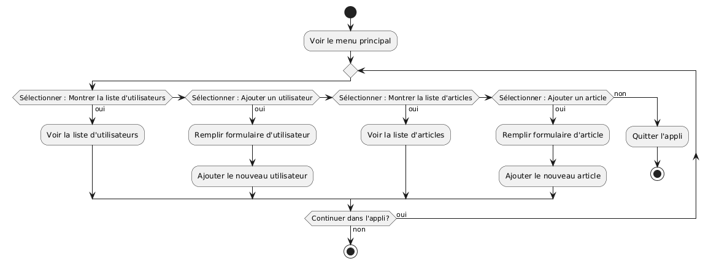
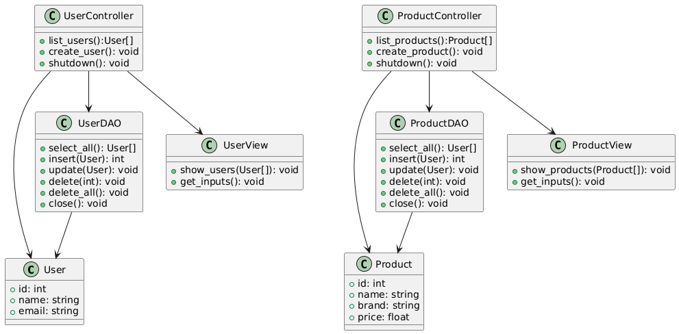
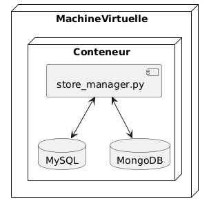

# Store Manager L01 - Documentation d'Architecture
Ce document, basé sur le modèle arc42, décrit une application de gestion de magasin pour le Labo 01, LOG430.

## 1. Introduction et Objectifs

### Panorama des exigences
L'application « Store Manager » est un système client-serveur pour la gestion des utilisateurs et des articles dans un petit magasin. Elle sert de projet éducatif pour démontrer :
- L'implémentation d'une architecture client-serveur
- Le patron MVC avec DAO (Data Access Object)
- Le support multi-bases de données (MySQL et MongoDB)
- La comparaison des avantages et des inconvénients entre une base de données relationnelle (MySQL) et NoSQL (MongoDB)

Nous ferons évoluer ce projet tout au long du cours LOG430, en intégrant de nouvelles fonctionnalités et en faisant évoluer notre architecture pour répondre aux nouvelles exigences.

### Objectifs qualité
| Priorité | Objectif qualité | Scénario |
|----------|------------------|----------|
| 1 | **Maintenabilité** | Séparation claire des responsabilités via le patron MVC+DAO |
| 2 | **Flexibilité** | Support de multiples backends de base de données (MySQL, MongoDB) |
| 3 | **Évolutivité** | Plusieurs clients peuvent se connecter au même serveur de base de données |

### Parties prenantes (Stakeholders)
- **Développeur.euse** : Apprendre/enseigner l'architecture client-serveur et les patrons MVC+DAO
- **Employé.es du magasin** : Utilisateur.trices gérant les articles et utilisateurs dans l'application 
- **Client.es du magasin** : Client.es servis par l'application (par exemple, en demandant à un.e employé.e à la caisse de rechercher la disponibilité ou le prix d'un article spécifique)

## 2. Contraintes d'architecture

| Contrainte | Description |
|------------|-------------|
| **Technologie** | Utilisation de Python 3, MySQL, MongoDB et Docker |
| **Déploiement** | Déploiement en conteneur Docker unique pour la simplicité |
| **Éducatif** | L'application doit démontrer clairement l'architecture client-serveur, la séparation MVC+DAO et la comparaison entre MySQL et MongoDB |

## 3. Portée et contexte du système

### Contexte métier

Le système permet aux employé.es du magasin de :
- Gérer les comptes utilisateurs, qui peuvent être des employé.es du magasin ou des client.es
- Gérer les articles vendus par le magasin

### Contexte technique
- **Client** : `store_manager.py` - Application Python CLI
- **Couche base de données** : Backends MySQL/MongoDB pouvant fonctionner ensemble ou de manière interchangeable
- **Communication** : Connexions directes entre l'application Python et les bases de données (pas de couche API HTTP)

## 4. Stratégie de solution

| Problème | Approche de solution |
|----------|---------------------|
| **Séparation interface** | Patron MVC avec classes Model, View et Controller dédiées |
| **Abstraction base de données** | Patron DAO pour abstraire les opérations de base de données |
| **Support multi-BD** | Implémentations DAO séparées pour MySQL et MongoDB |

## 5. Vue des blocs de construction

## 6. Vue d'exécution

## 7. Vue de déploiement

## 8. Concepts transversaux
- Patrons client-serveur, MVC, DAO
- Persistance, base de données relationelle, NoSQL

## 9. Décisions d'architecture

| Décision | Justification | Conséquences |
|----------|---------------|--------------|
| **Client-Serveur** | Démonstration d'une architecture client-serveur | L'évolutivité et la flexibilité sont limitées par rapport à d'autres architectures |
| **DAO séparés par type de BD** | Comparaison des avantages et des inconvénients entre une base de données relationnelle (MySQL) et NoSQL (MongoDB) | Classes DAO dupliquées |
| **Interface CLI** | Éviter la complexité d'un frontend web ou desktop | Expérience utilisateur moins « user-friendly » |

## 10. Exigences qualité

### Maintenabilité
- Séparation claire des responsabilités via MVC+DAO
- Conventions de nommage cohérentes à travers toutes les couches

### Flexibilité
- Facile d'échanger entre implémentations MySQL et MongoDB
- Extensible pour des types d'entités additionnels (démontré avec Users et Products)

### Évolutivité
- L'application peut avoir plusieurs clients connectés à un serveur
- L'application peut également avoir plusieurs serveurs, même s'ils ne partagent pas les mêmes données

## 11. Risques et dettes techniques
Non applicable pour cette application.

## 12. Glossaire

| Terme | Définition |
|-------|------------|
| **BD** | Base de données |
| **CLI** | Command-line interface : application d'interface de ligne de commande |
| **DAO** | Data Access Object : abstrait les opérations de base de données |
| **MVC** | Model-View-Controller : patron architectural |
| **NoSQL** | Not only SQL : désigne une famille de systèmes de gestion de base de données qui s'écarte du paradigme classique des bases relationnelles |